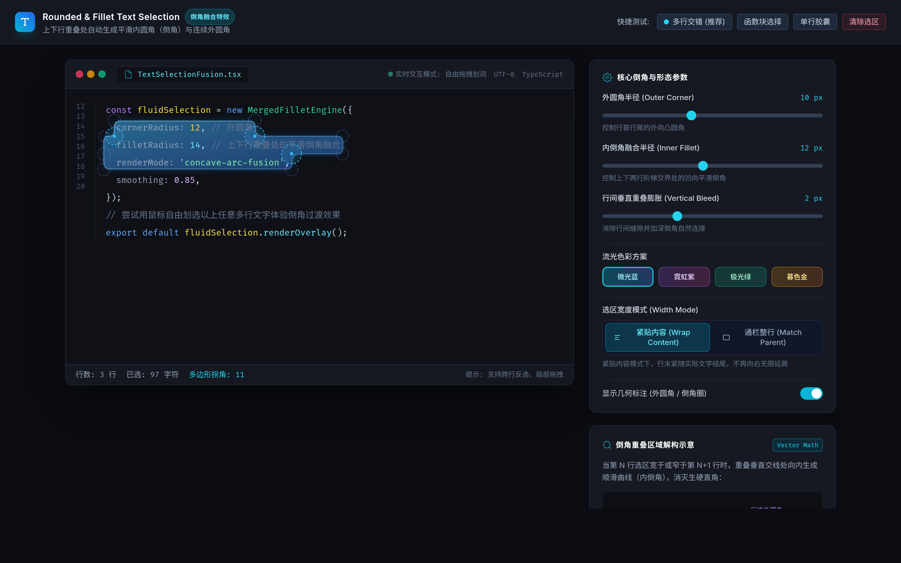

# AI Text Selection

文本编辑器 **圆角 + 倒角融合** 选择特效的交互式预览。多行选区由底层融合 SVG 路径绘制：行尾为外圆角，上下行宽度不一致的交界处自动生成平滑的内倒角（凹弧），消除生硬的直角。

**🔗 在线预览：<https://dodola.github.io/ai-text-selection/>**

[](https://dodola.github.io/ai-text-selection/)

## 特性

- **倒角融合**：相邻两行选区重叠处生成凹向内倒角，轮廓连续平滑
- **自由划选**：支持鼠标跨行拖拽、反向选择、局部选择
- **参数实时可调**：外圆角半径、内倒角融合半径、行间垂直膨胀
- **配色方案**：微光蓝 / 霓虹紫 / 极光绿 / 暮色金
- **宽度模式**：紧贴内容（Wrap Content）/ 通栏整行（Match Parent）
- **几何标注**：可开关显示外圆角与倒角圆的辅助标记
- **快捷测试**：多行交错、函数块选择、单行胶囊，一键复现

## 本地运行

无需构建，直接用浏览器打开 `index.html` 即可（页面通过 CDN 加载 Tailwind CSS 与 Google Fonts，需联网）。

```bash
git clone https://github.com/dodola/ai-text-selection.git
cd ai-text-selection
xdg-open index.html   # macOS 用 open
```

## 原理简述

1. 读取浏览器 `Selection` 的每一行 `ClientRect`，转换为相对编辑器的矩形
2. 逐行比较相邻矩形的左右边界，计算重叠处的内倒角位置
3. 以圆角矩形的并集生成单条 SVG `path`，外角用凸圆弧、交界处用凹圆弧连接
4. 原生 `::selection` 设为透明，由 SVG 层负责呈现

## 部署

静态页面，通过 GitHub Pages 从 `main` 分支根目录发布。

## License

MIT
